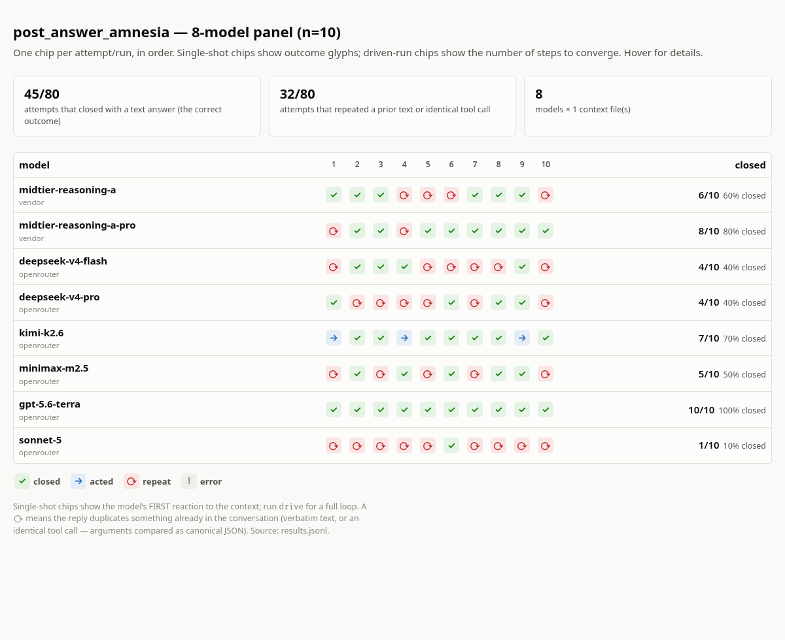

# agent-loop-testbed

A small, dependency-free harness for reproducing and measuring one specific
failure mode of tool-using LLMs: **degenerate tool-call loops** — the model
re-issuing the same call over and over, or restarting a task it has already
made progress on, until it exhausts the token budget or the turn is force-ended.

It grew out of a production investigation where a mid-tier model re-ran an
identical `date +%s` command 62 times in a single turn — every result differed
(the seconds changed), so ordinary "same call, same result" loop detectors never
fired. This tool lets you feed a recorded conversation to any OpenAI-compatible
model and watch, empirically, whether it loops.

Three questions it answers:

- **Entry** — given a conversation, does the model *start* looping on its first reaction?
- **Continuation** — given a conversation that is *already* mid-loop, does the model break out or keep going?
- **Closure / amnesia** — given a conversation where the model has *already answered*
  the last user message, does it close — or react to that message again as if its own
  answer were not sitting right there in the context? (In the production incidents
  behind this tool, this was the core strangeness: duplicated final answers,
  re-derived tasks.) Note the real incidents were not endless: one loop progressed
  slowly and finished, another was cut by the framework — so the interesting
  measurement is entry and per-reaction behavior, not "does it spin forever".



*An actual run: 8 models × 10 attempts on the `post_answer_amnesia` sample. Green = closed
correctly, red = repeated an identical call instead. Full interactive HTML (hover for each
reply) in [`examples/`](examples/), along with a driven-loop report.*

## Why it exists

Loop susceptibility is real but hard to reason about from anecdotes. Once a loop
is in the context window it tends to self-reinforce, and it correlates with model
tier more than with any single prompt. The only honest way to compare models — or
to decide whether a mitigation actually helps — is to replay the exact failing
message array and count outcomes. That is all this does.

## Install

Python 3.10+, standard library only. No `pip install` required.

```bash
git clone https://github.com/<you>/agent-loop-testbed
cd agent-loop-testbed
cp providers.example.json providers.json   # then add your models/keys
```

API keys are read from environment variables named in your `providers.json`
(e.g. `OPENROUTER_API_KEY`). Nothing is read from disk or any vendor store.

## Quick start

```bash
# 1. write the built-in synthetic sample conversations
python -m testbed gen-samples --out-dir samples

# 2. replay one mid-loop sample across a suite of models, 3 attempts each
export OPENROUTER_API_KEY=sk-...
python -m testbed run \
  --context samples/mono_loop_midstream.json \
  --config providers.json --suite openrouter-mid --n 3 \
  -o results.jsonl

# 3. render a local HTML report (no external assets, opens in any browser)
python -m testbed report results.jsonl -o report.html
```

Then open `report.html`. Each cell is a model’s reaction to a conversation; one
glyph per attempt (`✓` closed, `→` acted, `⟳` repeated, `⚠` error).

## Commands

| Command | What it does |
|---|---|
| `gen-samples` | Write the built-in synthetic sample conversations to `samples/`. |
| `reconstruct` | Turn a recording into a replayable context (see adapters below), optionally cut at a point. |
| `run` | Single-shot `model × context` grid → `results.jsonl` (the model’s *first reaction*). |
| `drive` | Drive one model through a *full* simulated loop (synthesized tool results) until it converges or hits `--max-steps`. |
| `report` | Render any `results.jsonl` to a local HTML report. |

### Bring your own conversation

`reconstruct` converts a recording into the OpenAI message array to replay:

```bash
# a file already in OpenAI chat format ({"messages":[...]} or a bare list)
python -m testbed reconstruct my_convo.json --adapter openai -o ctx.json

# cut the context at a chosen point so the NEXT model call is the one under test
python -m testbed reconstruct my_convo.json --cut-marker "identical to the original" -o ctx.json
python -m testbed reconstruct my_convo.json --cut-index 40 -o ctx.json
```

An `openclaw` adapter is included as an example of parsing a vendor session
`.jsonl` (assistant `thinking` → `reasoning_content`, `toolCall` → `tool_calls`,
`toolResult` → `role:"tool"`); adapt it for your own trace format.

### The full-loop driver

Single-shot `run` shows the *first* reaction. `drive` plays the whole loop,
synthesizing tool results from a small **stateful mini-filesystem** — edits
persist, reads return real content, and time-like commands return a fresh value
each call (preserving the "result changes every call" property that defeats
result-hash detectors). Statefulness matters: an early version returned canned
stateless results ("edit succeeded" / "file unchanged"), which itself provoked
verify-paranoia in the model and contaminated the measurement. That
contradictory world is still available as an explicit experimental condition:

```bash
python -m testbed drive --context samples/post_answer_amnesia.json \
  --config providers.json --suite openrouter-mid --runs 3 --max-steps 15

# A/B the world-consistency factor:
python -m testbed drive --context samples/saturated_pressure.json \
  --config providers.json --suite deepseek-v4-flash --world inconsistent
```

## Configuring models & providers

`providers.json` is the whole catalog — endpoints, which env var holds each key,
model→provider mapping, and named suites:

```json
{
  "providers": {
    "openrouter": { "base_url": "https://openrouter.ai/api/v1/chat/completions",
                    "api_key_env": "OPENROUTER_API_KEY", "reasoning_replay_default": true }
  },
  "models": {
    "deepseek-v4-flash": { "provider": "openrouter", "model_id": "deepseek/deepseek-v4-flash",
                           "reasoning_replay": false }
  },
  "suites": { "quick": ["deepseek-v4-flash"] }
}
```

`reasoning_replay` controls whether prior assistant `reasoning_content` is
re-sent on each call — some reasoning models require it, others reject it; it is
also a factor worth A/B-testing (`drive --strip-reasoning`).

## Samples

The bundled samples are **synthetic** — hand-authored to reproduce the failure
shapes, with no personal data. See `samples/` for each one’s notes.

- `mono_loop_midstream` — 15 identical calls already in context; measures *continuation*.
- `mono_loop_entry` — an instruction that interleaves fixed text with tool calls; measures *entry* from a clean start (control: no tested model looped from it in our runs).
- `benign_close` — a finished task the model only needs to confirm; measures spurious re-looping.
- `saturated_pressure` — a ~70k-char synthetic history (digest walls, tool cycles, corrections, resolved wobbles) ending in one trivial request; measures entry *pressure* on a saturated context.
- `post_answer_amnesia` — the saturated context, but the model has *already answered* and issued one redundant no-op call; measures closure vs amnesia (the strongest signal we have — see below).

### What we found (so you don't over-read your first grid)

Replaying the *real* incident contexts, loop **continuation** reproduced
reliably across mid-tier models. **Entry** from a cold saturated context is
rarer: ~10% of single-shot reactions on one mid-tier reasoning model repeated
a prior identical call (with visible distrust-of-tools reasoning — context
contamination at work), and driven multi-step runs self-recovered within a few
steps in both `--world` conditions and at both 70k and 150k chars.

The strongest reproduction is **post-answer amnesia**: on the
`post_answer_amnesia` shape (answer already given + one redundant no-op call),
the same model issued *one more identical call* in **70%** of reactions —
split between full amnesia ("the user asked me to… let me read the file
first": the task treated as never done, the model's own in-context answer
ignored) and perseverative verification ("the line is already present, let me
read to confirm"). Only 30% closed cleanly. If you measure one thing with this
tool, measure that.

## How outcomes are classified

Per attempt, mechanically:

- **closes** — finished with a text answer, no tool calls.
- **acts** — called a tool not seen before in this conversation (real progress).
- **repeat** — repeated a prior text (first 80 chars) or an identical prior tool call — the loop signal.
- **error** — API error.

`run` is single-shot, so small `n` is honest: it reports counts, never
percentages you can’t stand behind.

## Limitations

- Single-shot `run` captures only the first reaction; use `drive` to see a loop develop.
- Synthesized tool results in `drive` are approximations of a real environment.
- Loop entry is stochastic and often single-digit-percent; use a larger `n` to
  estimate a rate, and don’t over-read a handful of attempts.

## License

MIT.
